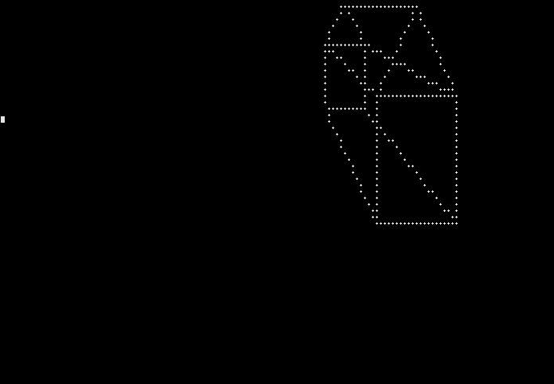
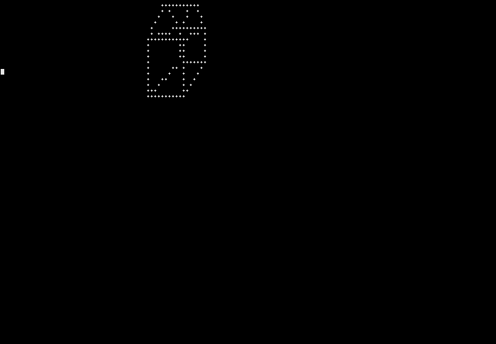
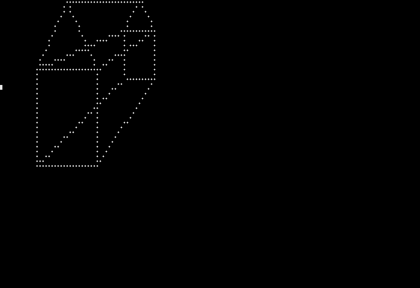
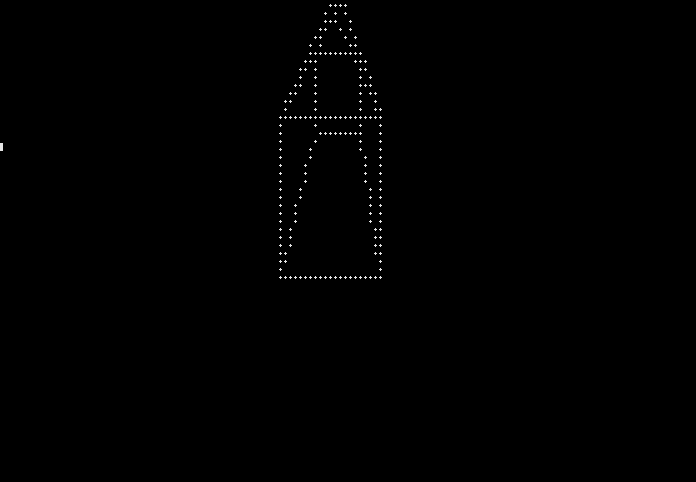

# 3D_bash_obfuscated

Before asking me "Why ?!" or telling me about the uselessness of this :

- I did it as a challenge, a friend of mine asked me if I could write a simple 3D engine with bash.
- It was a fun way to learn new things.
- But I admit, a bit of waste of time ;-)

How it works ?
==============

- It uses the famous Bresenham's line algorithm
- It links every x/y/z points from an array of cords
- It convert x/y/z pos to x/y plane ( x => x/z | y => y/z )
- It does not make real rotation around an axis (no trig then).

The code !
==========

The one liner::

        i=-154;u=100;w=120;J=110\ 1;N=\ 35\ 1E;U=5\ 2\ ;V=5\ 2E;B=5\ 1\ ;W=$w\ 1;M=\ 2E$u\ 1$B;while clear;do I=${I/-};while read -dE X Y Z E F G;do((H=Z+I,G+=I,e=(X+i)/H+70,f=Y/H,E=(E+i)/G+70,F/=G,h=E-e,j=F-f));h=${h/-};j=${j/-};((k=l=-1,d=h-j,e<E))&&k=1;((f<F))&&l=1;while((e!=E|f!=F));do echo -e "\033[$f;$e"f.;((m=2*d,m>-j))&&((d-=j,e+=k));((m<h))&&((d+=h,f+=l));done;done< <(echo $u 3$B$w$N$w 3$U$u 3$V$u 1$U$u 15 1E$u 3$B$u 3$V$u 1$U$J$M$J 1E$W$B$w$N$w 3$U$W$V$J 2 $J 1E$J 1 $w 15 1E$W$B$W$V$W$U$u 1$V$W$U$J$M$w 15 1E$u 1$B$u$N$u 1$U$u 3$V$w 3$B$w 3$V);read -n1 K;case $K in z)((I--));;s)((I++));;d)((i++));;q)((i--));;esac;done

Simply paste this line in a terminal and you'll get:

